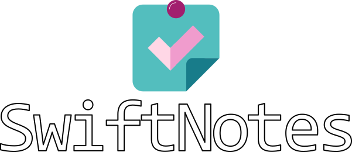

 

# SwiftNotes

SwiftNotes is a lightweight desktop application to keep track of tasks
across multiple projects. It is written in Python using the Qt binding 
[Pyside6](https://pypi.org/project/PySide6/).

### Table of Contents
- [Setup for development](#setup-for-development)
- [Overview](#overview)

## Setup for development
The [`utils/`](./utils/) directory holds scripts to enable and help developing.
To set up a conda environment with the needed dependencies given in 
[`environment.yml`](./utils/environment.yml) simply navigate into the [`utils/`](./utils/) directory and
run [`create_conda_env.bat`](./utils/create_conda_env.bat). Adapt the file in case you
want to use a specific name for the environment.

To create an executable run [`create_exe.bat`](./utils/create_exe.bat). This will create the the subdirectory
`exe/` in the base directory in which you will find `SwiftNotes.exe` under `dist/`. If
you used a different name for the environment adapt it in this `.bat` too.

User interface elements like icons and fonts can be found in [`ui/`](./ui/). If you
want to add resources add them to [`resources.qrc`](./ui/resources.qrc) and run
[`create_resources_rc.bat`](./ui/create_resources_rc.bat) to update [`resources_rc.py`](./src/resources_rc.py) in
[`src/`](./src/).

The source code is provided in [`src/`](./src/). Entry point to the application is
[`main.py`](./src/main.py).

## Overview
...