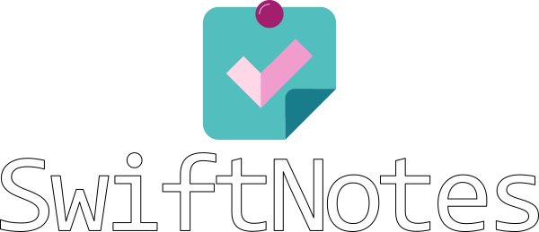

 

## Introduction

SwiftNotes is a lightweight desktop application to keep track of tasks
across multiple projects. It was written in Python using the Qt binding 
Pyside6.

## Setup
To set up a conda environment with the needed dependencies navigate to the 
`\utils` directory and simply run `00_create_conda_env.bat`.

If you altered the `.ui` files from `\ui` run `utils\01_create_ui_py.bat` to 
create `.py` files from them.

To create an executable run `utils\02_create_exe.bat`. This will create the 
`\exe` directory in which you will find `SwiftNotes.exe` under `\dist`.
